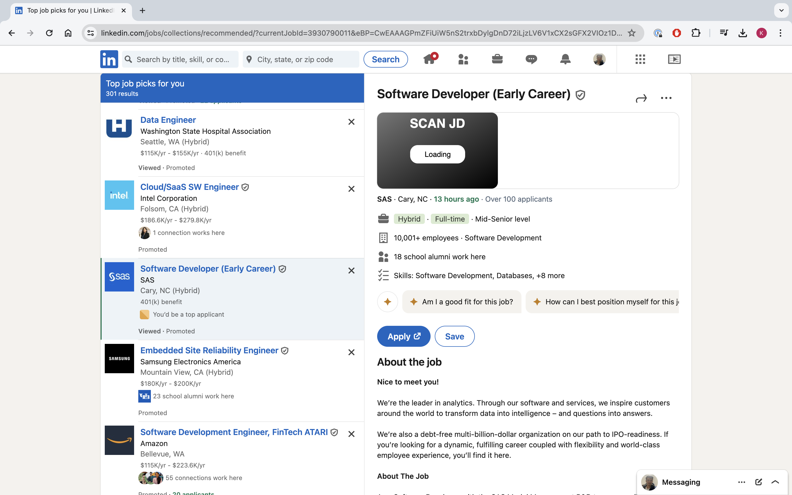
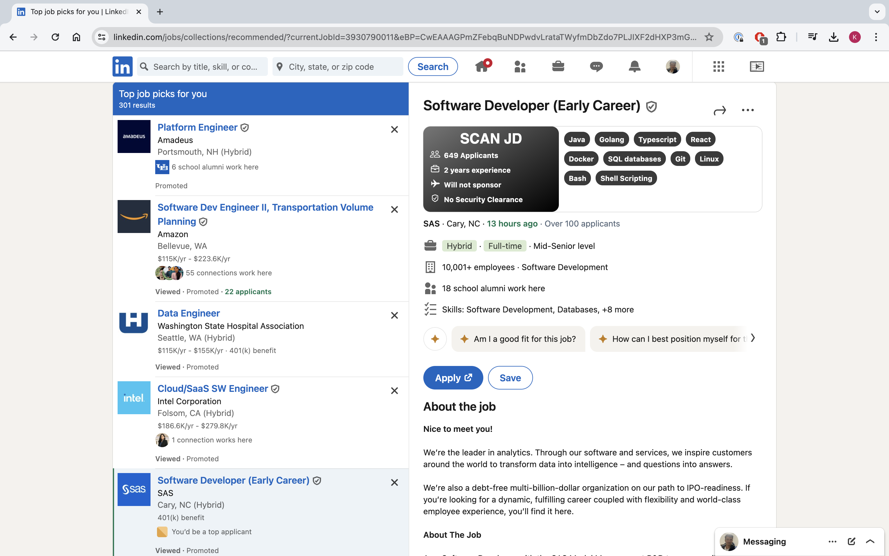
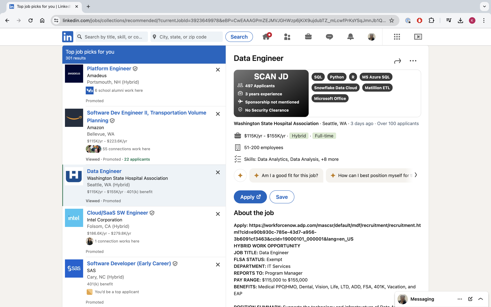

# Scan JD - Free Chrome Extension for streamlining your job search

Scan JD is a free Chrome extension designed to relieve your job search frustrations on LinkedIn. This tool efficiently scans job descriptions and delivers key parameters like sponsorship, experience, clearance, number of applicants and the key skills required in a very clean and concise manner directly on the LinkedIn jobs page, streamlining your job search process.

## Key Features:

- **Targeted Job Search:** Confidently and quickly identify the jobs where you are a fit (visa/experience/skills/etc) and invest time in applying where you feel you stand a better chance.

- **Real-time Results:** Instantly view key metrics and insights (5-6 seconds for free and 1-2 seconds for gpt-4o users) extracted from job descriptions directly on the LinkedIn interface.

- **Free and Paid options:** Comes with an option to use it completely free using Cohere Command-R-Plus model. If you are a chatgpt pro user, you can use that as well to get lightening fast results with your api key. 

- **No deployment required:** Uses docker to run the server locally on your computer, your data and api key stays with you as the backend is running locally in docker container.

## Mockups






## Installation:

1. Clone the repository:
    ```bash
    git clone https://github.com/kashyapsoni3010/SCAN_JD.git
    ```

2. Load the extension to Google Chrome:
    - Click on three dots on top right corner in Chrome tab
    - Click on 'Extensions'
    - Click on 'Manage extensions'
    - On top right, select 'Developer mode' if not already on
    - Select 'Load unpacked'
    - It will open a folder selection window, select the Folder SCAN_JD that you cloned from GitHub

3. Obtain your Free API key or use your paid GPT key:
    - Go to https://dashboard.cohere.com/api-keys
    - Get your free API key and store it somewhere
    - Follow something similar to get GPT keys (if you have a paid account)

3. Install docker desktop:
    Install docker desktop from official website: https://docs.docker.com/get-docker/ . This will also install docker.

4. Pull the docker image:
    ```bash
    docker pull kashyapsoni3010/scanjd:latest
    ```

5. Run the container:
    - USE FREE MODEL - COHERE COMMAND R
    ```bash
    docker run -d -p 8004:8004 -e API_KEY="cohere_api_key" -e MODEL="cohere" --name scanjd_instance kashyapsoni3010/scanjd
    ```
    - USE OPEN AI - PAID MODEL
    ```bash
    docker run -d -p 8004:8004 -e API_KEY="open_ai_api_key" -e MODEL="openai" --name scanjd_instance scanjd
    ```

    Please note, do not modify the above command for anything other than the API_KEY value. The MODEL env variable values must be as they are. Feel free to play with --cpus and --memory if you know docker.

## How to use it:

    Once you have added the chrome extension and have the container running, go to https://linkedin.com and navigate to job search page. Initially, when you are on a job search page as in mockups, you might not see the extension loaded. Please refresh the page to load the extension. Whenever you go to the linkedin jobs page, the extension might not load, please refresh the page and it will load.

    Wait for the extension to load the search results, initially it might take a bit longer, but eventually it usually takes 5-6 seconds for free models and 1-2 seconds for GPT users. If you run in any issues, just reload the extension. 

    You can refer to the video to understand how to use it.

<!--  -->

## Contributors:

I'd like to thank my friends 
[@patel-dhaval](https://github.com/patel-dhaval), [@namankhurpia](https://github.com/namankhurpia)
, [@MOHIT02082000](https://github.com/MOHIT02082000), [@Pavan-Pandya1](https://github.com/Pavan-Pandya1) for their invaluable contributions in developing SCAN JD

## Troubleshooting
Feel free to reach out to me at kashyapd@buffalo.edu for any issues. Mostly refreshing the page should solve almost all the errors, for any errors or bugs, kindly contact kashyapd@buffalo.edu